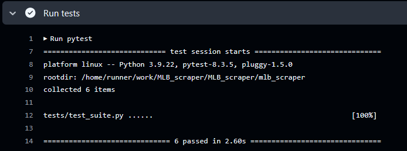

# MLB Roster API

Query the API with ```/roster/<TEAM NAME>```, where ```<TEAM NAME>``` is the name of your favorite MLB team!

View the deployed project [here!](https://mlb-roster-api-fycqbwcxg8fwgdam.centralus-01.azurewebsites.net/)

The team name must match the format used by the MLB site in their URLs, which is typically a lowercase, simplified version of the official team name. For example:
- The Chicago Cubs are `cubs`.
- The Washington Nationals are `nationals`.


# Container

The container is built with the contents of the ```mlb_scraper``` folder. The test files are excluded from the docker container, as they are not needed in the production build.

The application itself is a flask app. Flask was chosen for its minimal requirements, simple project initialization, and "take only what you need" philosophy.

# Deployment

The deployment pipeline consists of three steps: testing, building, and deploying. These steps ensure the API functions correctly, the container is built and pushed to an Azure Container Registry, and the container is deployed to an Azure Web App.


### Tests

First, the test suite is executed. A Python environment is configured for GitHub Actions to run the tests. The tests ensure that requests for multiple teams return a `200 OK` status code and that the returned JSON is not empty. Once the tests pass, the "test" job signals the "build" job to proceed.



### Build

Next, the container is built and pushed to an Azure Container Registry.

This step logs into the Azure Container Registry using GitHub secrets to manage credentials. The contents of the `mlb_scraper` folder are copied, and the container is built. After the container is successfully built, it is tagged with the commit hash and pushed to the container registry.

Once completed, the "build" job signals the "deploy" job to proceed.


### Deploy

Finally, the container is deployed to the Azure Web App Instance.

This step pulls the container image from the Azure Container Registry and configures the web app to use it as the application's source. After deployment, any dangling (old) Docker images are cleaned up to free up space and maintain a clean environment. The deployment pipeline then completes successfully.


